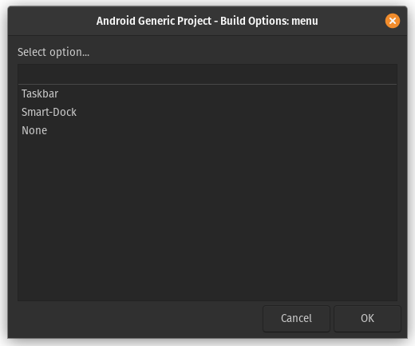

# Compile Waydroid - Using Android-Generic Project

For those not aware, [Android-Generic Project](https://android-generic.github.io), which is best known for bringing PC targets to AOSP based ROMs, also supports Waydroid targets too.&#x20;

This documentation will go over how to use AG for compiling Waydroid.&#x20;

## Getting started

To get started with Android/Lineage OS, you'll need to get familiar with [Repo](https://source.android.com/source/using-repo.html) , [Version Control with Git](https://source.android.com/source/version-control.html) and [Android-Generic Project documentation](https://android-generic-project.gitbook.io/documentation/android-generic-project-getting-started)

### Initializing

To initialize your local repository using the Lineage OS trees, use a command like this:

```
repo init -u https://github.com/LineageOS/android.git -b lineage-18.1 --git-lfs
```

Then we grab the Android-Generic and Waydroid bits:

```
wget -O - https://raw.githubusercontent.com/waydroid/android_vendor_waydroid/lineage-18.1/manifest_scripts/generate-manifest.sh | bash
```

```
git clone https://github.com/android-generic/vendor_ag vendor/ag
```

### Syncing

Then we can sync up:

```
repo sync
```

And setup the local build environment:

```
. build/envsetup.sh
```

### Configuring

#### Legacy Method:

The legacy method is driven by a simple bash script found in vendor/ag/legacy-scripts/waydroid-build/waydroid\_build.sh

```
bash vendor/ag/legacy-scripts/waydroid-build/waydroid_build.sh --help
Compiles and packages Waydroid for target arch

Syntax: 
	waydroid_build [-a|--arch arm|arm64|x86|x86_64] [-c|--clean] [-p|--package] [-r|--rom_name Name]
options:
	-a|--arch (option) Specify arch for build (arm, arm64, x86, x86_64)
	-c|clean     Run 'make clean' before build
	-p|--package     Package build using ROM_NAME
	-r|--rom_name (ROM_NAME) Name used for package build filename (ex: Lineage-17.1)
```

So to compile Waydroid for x86\_64, making clean, and package it in a .zip. You would use this command:

```
bash vendor/ag/legacy-scripts/waydroid-build/waydroid_build.sh -a x86_64 -c -p
```

#### GUI Method:

We now want to use AG for the following portions. So in the terminal, type:

```
ag-menu waydroid
```

You should now see a menu like this:

.png>)

We can skip the first 2 steps (01-generate-manifest-gui & 02-sync-project), and continue to the&#x20;

#### 03-apply-base-patches

Click on it and hit OK.&#x20;

This will start to apply all the waydroid patches on top of Lineage OS. If there are any conflicts, please refer to the [Manual Patch Resolution](manual-patch-resolution.md) doc. Otherwise, you can continue to the next step.&#x20;

#### 10-build-options

The build options are mostly the same as native PC builds, so we can explore them a little.&#x20;

#### Select Product Type:

.png>)

This will let you select the target device for compiling

#### Select Variant Type:

.png>)

This will allow you to select the variant type (user, userdebug, eng). Userdebug is the most common for testing.&#x20;

Select Apps Type:

.png>)

<mark style="color:orange;">!!WARNING - NOT ALL ARCH TARGETS ARE FULLY SUPPORTED YET!!</mark>\
This will let you compile Waydroid with various app types included (FOSS, GMS, EMU-Gapps, OpenGapps & Vanilla)&#x20;

#### Select Desktop Mode Integration:



Waydroid by default includes one type of custom Desktop Mode UI, and that is Boringdroid. This will let you select an alternative option to package along side.&#x20;

Select Extra Options:

.png>)

Make Clean before build - Self explanatory, it runs 'make clean' before compiling

Generate Package .zip - Generated a package .zip after compile if complete <mark style="color:orange;">(requires 7zz & simg2img to be installed)</mark>&#x20;

#### Run Make Clean:

Just runs 'make clean', nothing fancy

#### Start the Build:

This will launch the compile with all the selected portions from above. If it requires any missing information, the terminal or popup window will let you know.&#x20;

From here, things are pretty much 1:1 for AG's PC build instructions, so you can refer to the [Android-Generic Project Documentation](https://android-generic-project.gitbook.io/documentation/android-generic-project-getting-started) for further instructions
