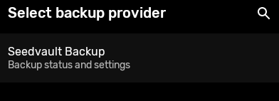
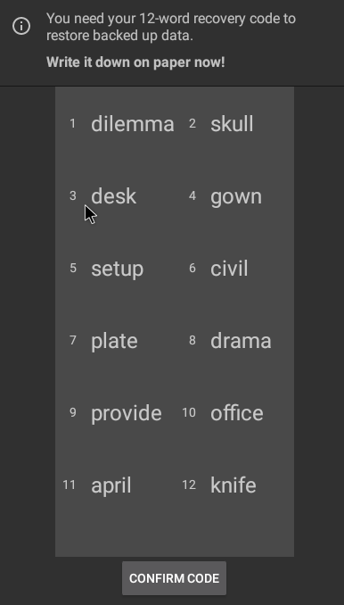
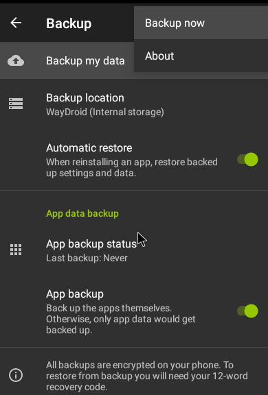
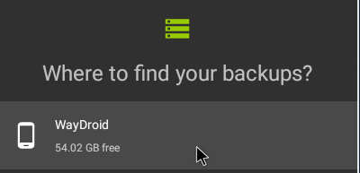
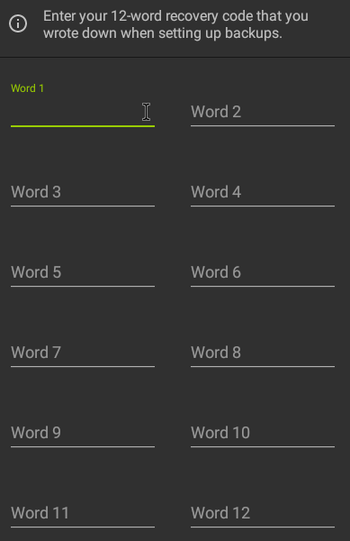

# Backup and restore apps and data

[Seedvault](https://github.com/seedvault-app/seedvault) can be used to taking backup and restore it. It is preinstalled on Waydroid.

## Backup:
### 1. Choose Seedvault as backup provider
Go to Settings > System > Backup > Change backup provider. And choose Seedvault,

### 2. Note down passphrase
A passphrase is shown. This is used for encrytion. It wil asked on restoration.

### 3. Take backup
Tap on 'Backup' from three-dots menu.

Successfully backed up. The backup data will be at `~/.local/share/waydroid/meda/0/.SeedVaultAndroidBackup
`

## Restore
### 1. Copy backup contents

Copy the `.SeedVaultAndroidBackup` to  `~/.local/share/waydroid/meda/0/`

### 2. Start restore activity.
You need to run `am start com.stevesoltys.seedvault/.restore.RestoreActivity` in shell inorder to start the restoration activity. You can this either on `waydroid shell` or `adb shell`.

You will be asked to choose storage.

### 2. Enter passphrase for decryption

You need to enter the passphrased there was shown while setting up Seedvault

### 3. Restore

Click on restore.
